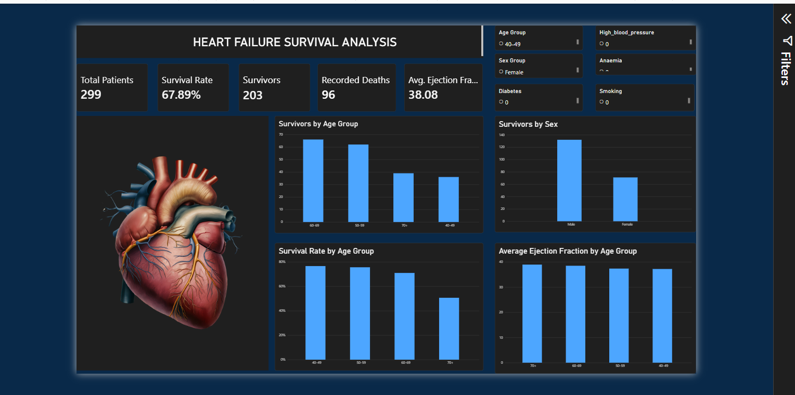

# Heart Failure Survival Analysis

**Heart Failure Survival Analysis using Excel and Power BI**

## Project Overview

This project analyzes clinical records from a cohort of heart failure patients to explore survival outcomes and identify patterns across demographic and clinical factors.

The analysis focuses on patient survival, recorded mortality, age groups, sex, and ejection fraction to provide an interactive view of outcomes within the dataset.

## Objectives

- Analyze overall patient survival outcomes
- Compare survivors across different age groups
- Compare survivor counts by sex
- Examine survival rates across age groups
- Analyze average ejection fraction across age groups
- Build an interactive healthcare analytics dashboard in Power BI

## Dataset

The project uses the **Heart Failure Clinical Records Dataset**, containing **299 patient records** and **13 clinical variables**.

### Key Variables

- Age
- Anaemia
- Creatinine Phosphokinase
- Diabetes
- Ejection Fraction
- High Blood Pressure
- Platelets
- Serum Creatinine
- Serum Sodium
- Sex
- Smoking
- Follow-up Time
- Death Event

### Dataset Source

- Kaggle — Heart Failure Clinical Records Dataset
- UCI Machine Learning Repository — Heart Failure Clinical Records

## Tools & Technologies

- **Microsoft Excel** — data preparation and initial cleaning
- **Power BI** — data modeling, DAX calculations, visualization, and dashboard development
- **DAX** — KPI calculations and analytical measures

## Data Preparation

The dataset was reviewed and prepared before visualization.

Key preparation steps included:

- Reviewing the dataset structure
- Checking data types
- Checking for duplicate records
- Preparing categorical fields
- Creating age groups
- Creating a readable sex classification
- Importing the prepared data into Power BI
- Creating analytical measures using DAX

## Key KPIs

| KPI | Value |
|---|---:|
| Total Patients | 299 |
| Survivors | 203 |
| Recorded Deaths | 96 |
| Survival Rate | 67.89% |
| Average Ejection Fraction | 38.08 |

## Dashboard

The Power BI dashboard provides an interactive view of heart failure survival outcomes.

### Dashboard Visuals

- Survivors by Age Group
- Survivors by Sex
- Survival Rate by Age Group
- Average Ejection Fraction by Age Group
- Interactive demographic and clinical slicers
- KPI cards for overall patient outcomes

## Dashboard Preview

## Key Insights

The analysis shows that:

- The dataset contains 299 heart failure patient records.
- 203 patients were recorded as survivors.
- 96 patients experienced the recorded death event.
- The overall recorded survival rate is approximately 67.89%.
- Survivor counts vary across age groups.
- Survivor counts differ between male and female patients within this cohort.
- Survival rates vary across age groups.
- Average ejection fraction varies across age groups.

These findings describe patterns observed within the available cohort and should not be interpreted as a clinical prediction model.

## Analytical Approach

The project followed an **Excel → Power BI → DAX → Dashboard** workflow.

### Excel

Excel was used for initial data preparation and review.

### Power BI

The prepared dataset was imported into Power BI for data modeling and visualization.

### DAX

DAX measures were created to calculate key metrics including:

- Total Patients
- Total Survivors
- Total Recorded Deaths
- Survival Rate
- Average Ejection Fraction

Calculated fields were also used to group patients by age and classify sex categories.

## Project Files

- `Heart failure Analysis.pbix` — Power BI report
- `dashboard-preview.png` — Dashboard preview
- `README.md` — Project documentation
- `LICENSE` — MIT License

## Limitations

The dataset represents a specific heart failure patient cohort and should not be assumed to represent all heart failure patients.

The analysis is descriptive and exploratory. It does not establish causation and does not provide individual-level medical risk predictions.

## Disclaimer

This project is intended for **educational and portfolio purposes only**.

The analysis describes patterns observed in the provided heart failure clinical records dataset. It is not intended for medical diagnosis, individual patient risk prediction, or clinical decision-making.

## Author

**Emmanuella Ahamafula**

Data Analyst | Power BI | Excel | Data Visualization

